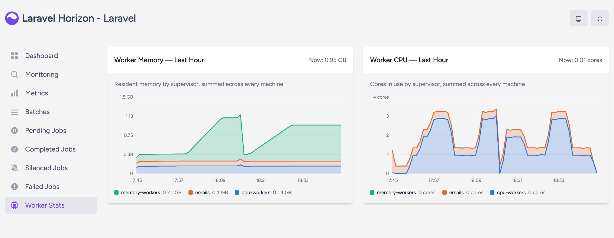

# Horizon Worker Stats

A **Worker Stats** page for the Laravel Horizon dashboard: how much memory and CPU your whole worker fleet is using, over the last 24 hours.

Horizon tells you how many jobs your workers get through and how long they wait. It does not tell you what running them costs. This adds two charts: the resident memory of every `horizon:work` process on every machine, summed, and the CPU cores they keep busy — each stacked by supervisor, so you can see which of them is using it.



## Install

```bash
composer require boring-o11y/horizon-worker-stats
```

Restart Horizon (`php artisan horizon:terminate`, and let your process manager start it again) so the supervisors pick up the sampler. A **Worker Stats** link appears in Horizon's sidebar, and the charts fill in from then on.

To change anything:

```bash
php artisan vendor:publish --tag=horizon-worker-stats-config
```

## How it measures

Every Horizon supervisor fires `SupervisorLooped` about once a second. On that event, at most every 10 seconds, the package takes the pids of the supervisor's running workers straight off its process pools — including workers still finishing their last job after a scale-down, since they hold memory until they exit — and reads each one:

- **On Linux**, from `/proc/<pid>/stat` (user + system CPU time) and `/proc/<pid>/status` (`VmRSS`). Two file reads per worker, no fork, and it works in slim container images that do not ship `ps`.
- **Elsewhere**, with one `ps -o pid=,rss=,time=` call for all of them.

Measuring from the outside means the numbers include everything the worker process holds — framework, extensions, allocator slack — which is what matters when you are sizing a machine or wondering why the OOM killer visited.

Each pair of samples becomes one span. Memory is the average of the two totals; CPU is the sum of each worker's counter increase. A worker absent from the earlier sample, or whose counter went *down* (the pid was reused by a new worker), counts its whole counter. Some care goes into not drawing things nobody measured:

- **A gap over 60 seconds** between two samples means the supervisor loop stalled. The baseline is reset instead of interpolating a line across it.
- **Workers that exist but could not be read** (no `ps`, `/proc` hidden) drop the sample rather than record a fleet using nothing — and the next attempt still waits out the interval, so a host without `ps` does not shell out every second.
- **A bucket nothing sampled** is a gap in the line, not a zero.

### Adding up many supervisors

Every supervisor on every machine writes into the same bucket hashes, one field set per supervisor: byte-seconds, CPU-seconds, seconds actually covered, and the first and last instant it sampled. All of it goes in with a single Lua call, and a span that crosses a bucket boundary is split between the two in proportion.

When the page reads a bucket, each supervisor is averaged **over its own covered seconds** and then weighted by the part of the bucket it was running for. Dividing one fleet-wide sum by one fleet-wide span is wrong both ways: supervisors sample out of step, so the in-progress bucket would dip at the right edge while most of them have not yet written their latest span; and a supervisor restart would leave a gap that read as zero use. The weighting also means a machine removed half way through a bucket only counts for the half it ran.

The breakdown groups supervisors by the name in your Horizon config (`emails`, `reports`, …), not by the full `host-XXXX:emails` name Horizon gives them: that part changes every time Horizon restarts. So one supervisor keeps one band across deploys and across machines. A supervisor absent from a bucket other supervisors sampled counts as zero there, so the bands always add up to the total. Past eight supervisors, the rest fold into one "Other" band.

Memory is RSS, which counts shared pages in every process that maps them, so a sum across workers slightly overstates what the machines are actually holding.

## Storage

One small Redis hash per bucket (`worker_stats:{timestamp}`), on Horizon's own connection and under Horizon's key prefix. Each expires one interval after it leaves the chart, so there is nothing to trim and no per-supervisor bookkeeping: a supervisor that goes away simply stops writing.

Nothing is written on the job path — the sampler runs in the supervisor, not in the workers.

To wipe the history:

```bash
php artisan horizon-worker-stats:clear
```

## How the page gets into the dashboard

Horizon's dashboard is a compiled Vue bundle inlined into one Blade layout. There is no route to register, no screen to add, no asset hook. So this package takes over `horizon::layout`, renders the layout it replaced, and splices three things into the result:

| Anchor in Horizon's layout | What goes in |
|---|---|
| `<router-view></router-view>` | the page's mount point |
| `<ul class="nav flex-column">` | the sidebar link |
| `</body>` | this package's script and styles |

The layout it replaced is aliased under a namespace of this package's own, so it chains with other add-ons that override the layout the same way (such as [horizon-delayed-jobs](https://github.com/boring-o11y/horizon-delayed-jobs)) in either boot order.

The charts are drawn as plain SVG by a small inline script. Horizon bundles Chart.js but does not expose it, and shipping a second copy on every dashboard load for two line charts is not worth it. There is no build step.

**Every splice is optional.** A missing anchor logs a warning naming what the dashboard will be without, and leaves the rest alone. A scheduled canary job runs the suite against Horizon's development branch so drift shows up here before it shows up for you.

## Configuration

| Key | Default | |
|---|---|---|
| `enabled` | `true` | Turn the package off entirely: no sampling, no routes, no view override, no link |
| `path` | `worker-stats` | The dashboard-relative path the page answers to |
| `label` | `Worker Stats` | The sidebar label |
| `interval` | `15` | Minutes per chart point |
| `retention` | `24` | Hours the charts cover |
| `poll_interval` | `60000` | Page refresh interval in milliseconds |

The data endpoint is `GET {horizon.path}/api/worker-stats`, behind the same middleware and `viewHorizon` gate as the rest of the dashboard.

## Compatibility

PHP 8.1+, Laravel 10–13, Horizon 5.24+. Both `phpredis` and `predis` are supported and the suite runs against each.

## Testing

Everything runs in Docker:

```bash
docker compose run --rm app composer install
docker compose run --rm app vendor/bin/phpunit
docker compose run --rm -e REDIS_CLIENT=predis app vendor/bin/phpunit
```

## Credits

The layout-override technique is the one [knobik/laravel-horizon-job-output](https://github.com/knobik/laravel-horizon-job-output) uses (MIT).

Originally built as part of [Skyline](https://boring-observability.dev/skyline), where these charts sit on the main dashboard alongside restart tracking and per-job memory and CPU cost. For more visibility into Horizon queues, check out [Skyline](https://boring-observability.dev/skyline) — a drop-in replacement for Laravel Horizon.

## License

MIT. See [LICENSE.md](LICENSE.md).
